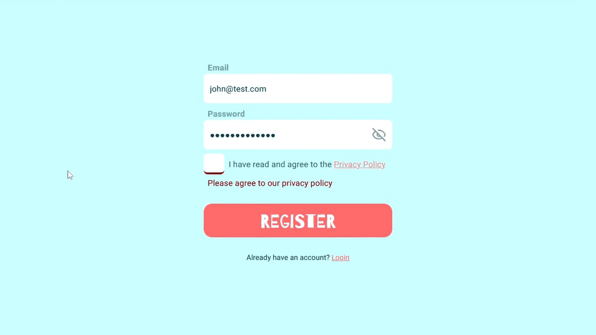

# QuizApp: Real-time Multiplayer Quiz Platform

QuizApp is a real-time multiplayer quiz game focused on smooth animations and responsive interactions. Users can register as hosts and create and run quizzes, and players can join as anonymous users. The app updates questions and answer results live and uses a web-based setup to support fast, interactive gameplay.

## Features
* Register and login as a host
* Create and start a quiz
* Lobby on the screen of the host with all the players
* Closing lobby
* Connecting by pin and giving custom name (anonymous)
* Starting quiz with players in lobby
* Answering questions and seeing results

### Joining with custom name

### Starting quiz and answering as player

### Registering

## Tech Stack
There is a seperation between frontend and backend.

### Frontend
* Next.js 15.2.4
* Tailwind v4
* Framer Motion (for the animations)

### Backend
* .NET 8.0
* .NET Entity Framework
* ASP.NET
* SignalR
* Postgresql

## High Level Architecture

## Setup Instructions
### Database
The project includes a docker compose, either run docker compose from root or create a new database with a local installation of psql. The docker compose requires credentials, simply copy over the .env.example into a .env for it to take those credentials.

### API
.NET 8.0 and ASP.NET 8.0 sdk and runtimes need to be installed.
* Navigate over to the api/ directory
* Copy over appsettings.example.json into appsettings.json
* Replace the JWT key string with a valid key in the appsettings
* Run the command: `dotnet watch run` or launch from Visual Studio if that is preferred

### Frontend
Node 20+ is required to run this project locally.
* Navigate over to the frontend/ directory
* Run the command `npm install`
* Configure the .env files according to your host names and other settings like port to the API
* Run the command `npm run dev`
